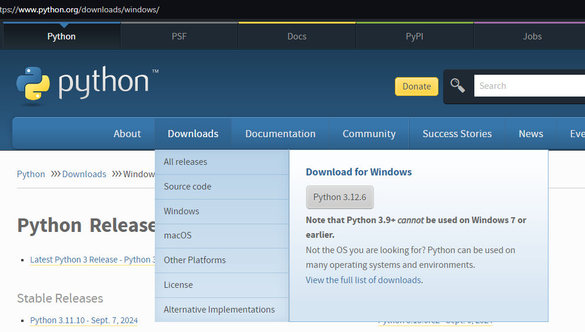
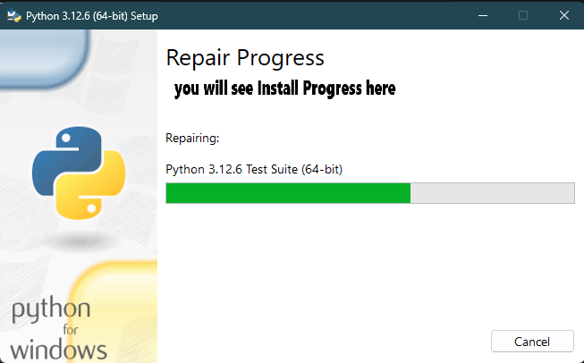
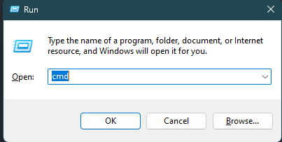
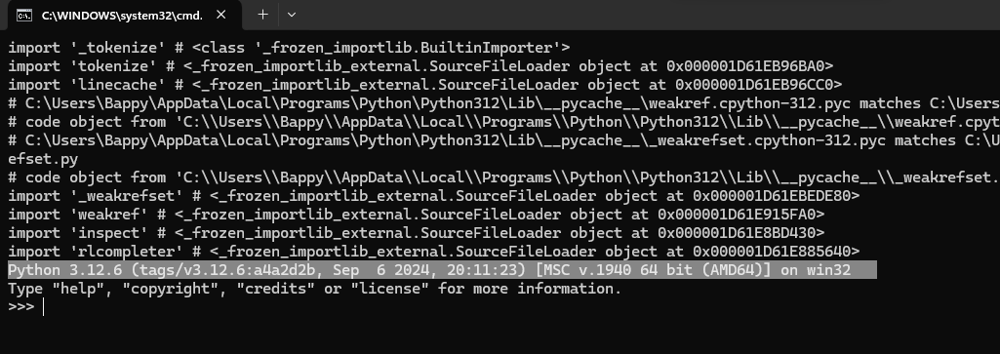
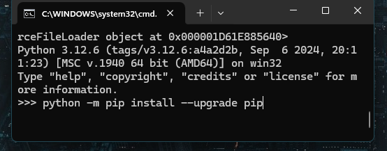
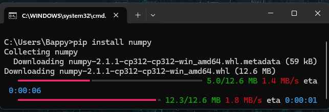
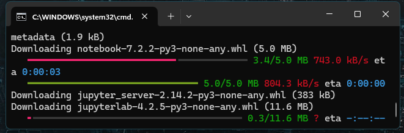
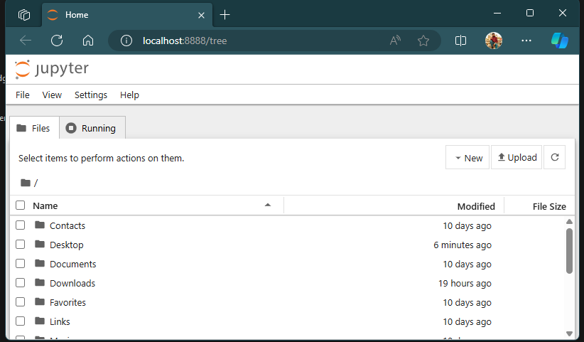
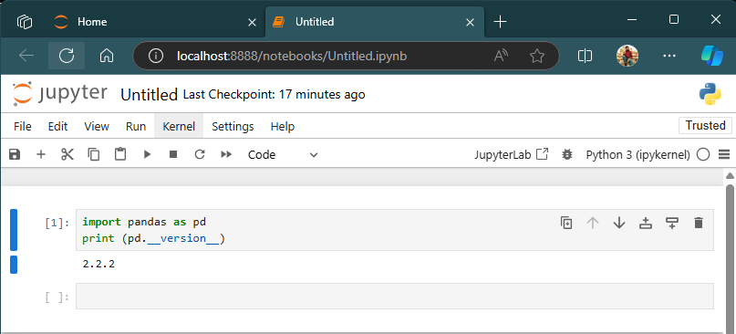

# Experiment Name : Introduction to Python and Setting Up Python for AI Development


**Installation Guideline for Python, NumPy, Jupyter Notebook, and Pandas (Windows 10/11)**

This guide will walk you through installing **Python**, **NumPy**, **Jupyter Notebook**, and **Pandas** on your Windows 10/11 machine. Whether you're starting fresh or upgrading to the latest versions, these step-by-step instructions will help you set up a powerful Python environment for data science, machine learning, or any other Python-based projects.

---

## Prerequisites
Ensure you have an active internet connection to download Python, pip, and the necessary libraries.

---

## 🚀 Step-by-Step Installation Instructions

### Step 1: Download and Install Python (Latest Version)


1. Visit the official Python website at [www.python.org](https://www.python.org/) and click on the **Download Python** button. The website will automatically suggest the latest version suitable for your system.
2. Once the installer is downloaded, run it by double-clicking the file.
3. In the installation window, ensure you select the **`Add Python to PATH`** checkbox — this is crucial for running Python from the command line.
4. Continue clicking **Next** through the installation steps, leaving everything else as default.

     

---

### Step 2: Confirm Python Installation
To verify the Python installation:
1. Press `Win + R`, type `cmd`, and hit Enter to open the command prompt.

    

2. In the command prompt, type the following command and press Enter:
    ```bash
    python --version
    ```

3. You should see the installed version of Python printed out, confirming that Python is installed correctly.

    

If the version shows up correctly, your Python installation is complete! 🎉

---

### Step 3: Install NumPy
To install NumPy, you'll need to ensure that `pip`, Python’s package installer, is up to date:
1. In the command prompt, press `Ctrl + Z` or `Ctrl + C` to return to the terminal, then type:
    ```bash
    python -m pip install --upgrade pip
    ```
     

2. Now, install NumPy by running:
    ```bash
    pip install numpy
    ```
    

3. After installation, verify it by running Python and importing NumPy:
    ```bash
    python
    import numpy as np
    ```

If no errors occur, NumPy has been installed successfully! ✅

> **Troubleshooting Tip:**  
> If you encounter errors, try upgrading `setuptools`:
> ```bash
> pip install --upgrade setuptools
> ```
> Then, repeat the NumPy installation steps.

---

## 🔧 Installing Jupyter Notebook and Pandas

Now that Python and NumPy are set up, let’s proceed with installing **Jupyter Notebook** and **Pandas**. These tools are essential for data analysis and visualization, making them must-haves for any data science environment.

---

### Step 4: Install Jupyter Notebook
1. In the same command prompt, install Jupyter Notebook by running:
    ```bash
    pip install notebook
    ```
    
    

2. Once the installation is complete, launch Jupyter Notebook by typing:
    ```bash
    jupyter notebook
    ```
This command will open the Jupyter interface in your browser, where you can create new notebooks and run Python code interactively.



---

### Step 5: Install Pandas
1. After installing Jupyter Notebook, install **Pandas** by running:
    ```bash
    pip install pandas
    ```

2. Verify that Pandas is installed correctly by creating a new notebook in Jupyter and running the following code:
    ```python
    import pandas as pd
    print(pd.__version__)
    ```

     

If you see the Pandas version printed, the installation is successful! 🎉

---

## Discussion 📝

By following this guide, you've set up a robust Python environment with essential tools for data science, including **NumPy**, **Pandas**, and **Jupyter Notebook**.

### What's Next? 💡

Now that we have these foundational tools, we can begin working on Python projects ranging from basic scripting to advanced data analysis and machine learning. Explore different Python libraries like:

- **`matplotlib`** for data visualization.
- **`scikit-learn`** for machine learning.
- **`TensorFlow`** for deep learning.

> Feel free to experiment and explore the vast Python ecosystem!

---

## Troubleshooting 🛠️

If you encounter any issues during installation, refer back to the troubleshooting tips provided or consult the official documentation for Python, NumPy, Pandas, or Jupyter Notebook. Make sure your packages are up to date, and don't hesitate to seek help from the community.

---

_Authored by:_  
**Md. Sazzad Ahsan**

**ID:200037**

